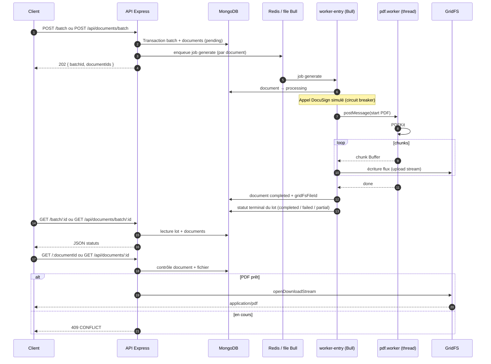

# Document Generator

API Node.js (Express 5) pour générer des PDF par lots : file **Bull** (Redis ou mémoire), stockage **GridFS** (MongoDB), génération CPU en **worker threads**, disjoncteurs **Opossum**, logs **JSON** structurés (`correlationId`, `batchId`, `documentId`) et métriques **Prometheus**.

## Table des matières

1. [Démarrage rapide](#démarrage-rapide)  
2. [Documentation API (OpenAPI / Swagger / Postman)](#documentation-api-openapi--swagger--postman)  
3. [Architecture — traitement par lot (séquence)](#architecture--traitement-par-lot-séquence)  
4. [Choix techniques](#choix-techniques)  
5. [Observabilité](#observabilité)  
6. [Benchmarks et courbes (Excel)](#benchmarks-et-courbes-excel)  
7. [Exemples curl](#exemples-curl)  
8. [Variables d’environnement](#variables-denvironnement)  
9. [Tests et qualité](#tests-et-qualité)

---

## Démarrage rapide

```bash
cp .env.example .env
docker compose up --build
```

- API : [http://localhost:3000](http://localhost:3000)  
- Swagger UI : [http://localhost:3000/api-docs](http://localhost:3000/api-docs)  

En local (MongoDB + Redis selon le `.env`) :

```bash
npm install
npm run build
npm run dev
```

Dans un second terminal, le processeur de file (sauf si `QUEUE_BACKEND=memory`, où le worker est intégré au serveur) :

```bash
npm run dev:worker
```

---

## Documentation API (OpenAPI / Swagger / Postman)

| Ressource | Emplacement |
|-----------|-------------|
| Spécification **OpenAPI 3** (exemples requêtes/réponses, schémas, erreurs) | [`docs/openapi.yaml`](docs/openapi.yaml) |
| **Swagger UI** (Try it out) | `GET /api-docs` une fois l’API démarrée |
| **Collection Postman** v2.4 | [`postman/document-generator.collection.json`](postman/document-generator.collection.json) |

**Postman** : importer la collection, définir `baseUrl` (ex. `http://localhost:3000`) et `workerMetricsUrl` (ex. `http://localhost:9464`). Enchaîner **Create batch (userIds)** puis **Get batch** / **Get document PDF** : les tests enregistrent `batchId` et `documentId` dans les variables de collection. La collection couvre aussi `/health`, `/metrics`, `/metrics` worker, cas d’erreur 400/404.

---

## Architecture — traitement par lot (séquence)

Deux façades HTTP existent pour les lots : `/batch` et `/api/documents/batch` (variante `userIds`). Le flux métier est le même.



Processus : **serveur HTTP** (`server.ts`) pour l’API, **worker** (`worker-entry.ts`) pour consommer la file (sauf mode `QUEUE_BACKEND=memory`).

---

## Choix techniques

### Pourquoi Bull ?

- **Découplage** : l’API accepte vite les lots (202) pendant que la charge CPU est isolée dans un ou plusieurs workers.
- **Redis** : file persistante, partagée entre plusieurs instances de worker pour monter en parallélisme horizontal.
- **Fonctionnalités** : tentatives multiples, backoff exponentiel, concurrence par type de job, API stable et largement utilisée dans l’écosystème Node.
- **Alternative mémoire** : `QUEUE_BACKEND=memory` permet un scénario sans Redis (un seul processus, worker intégré), utile pour démo ou repli contrôlé — ce n’est pas un remplacement Redis multi-processus.

### Pourquoi GridFS ?

- **Gros binaires** : les PDF sont écrits et lus en **flux**, sans charger tout le fichier en RAM côté serveur.
- **Cohérence avec MongoDB** : métadonnées des documents (`Document`) et fichiers dans la même plateforme ; pas de service objet (S3, etc.) imposé pour un MVP ou un sujet pédagogique.
- **Téléchargement** : `openDownloadStream` se branche naturellement sur la réponse HTTP.

### Autres choix (rappel)

- **Worker threads** : parallélisme réel pour PDFKit ; un thread bloqué n’arrête pas tout le processus worker.
- **Opossum** : circuit breaker sur la lecture GridFS et sur l’appel **DocuSign simulé**, avec métriques `circuit_breaker_state{name="..."}`.

---

## Observabilité

- **Logs** : JSON (Winston), champs `correlationId`, `batchId`, `documentId` selon le contexte, `environment` (NODE_ENV).
- **Prometheus** : `GET /metrics` sur l’API ; le worker expose aussi `/metrics` (port `WORKER_METRICS_PORT`, défaut 9464). Métriques clés : `documents_generated_total`, `batch_processing_duration_seconds`, `queue_size`.
- **Résumé texte** : `GET /observability`.
- **Stack Grafana + Prometheus** : voir [`observability/README.md`](observability/README.md) et `docker-compose.observability.yml`.

---

## Benchmarks et courbes (Excel)

- Script de lot : `npm run benchmark:batch` (rapport JSON, série CSV).
- Export CSV adapté Excel (FR) : `npm run benchmark:csv-excel-fr`.
- **Courbes** : le fichier **`benchmark-series-excel-fr-avecgraph.xlsx`** à la racine du dépôt contient les graphiques sur les séries de benchmark (progression `completed`, temps, etc.). Les sources CSV associées incluent notamment `benchmark-series.csv` / variantes `*-excel-fr*.csv`.

Pour la charge HTTP ou les métriques côté serveur, combiner **Prometheus** (scrapes API + worker) et **Grafana** (tableau de bord fourni sous `observability/grafana/dashboards/`).

---

## Exemples curl

**Santé**

```bash
curl -s http://localhost:3000/health
```

**Métriques**

```bash
curl -s http://localhost:3000/metrics
```

**Résumé observabilité (texte)**

```bash
curl -s http://localhost:3000/observability
```

**Créer un lot (202)**

```bash
curl -s -X POST http://localhost:3000/batch \
  -H "Content-Type: application/json" \
  -H "x-correlation-id: demo-1" \
  -d '{"documents":[{"title":"Rapport","content":"Contenu du rapport."}]}'
```

**État du lot** (remplacer `BATCH_ID`)

```bash
curl -s http://localhost:3000/batch/BATCH_ID
```

**Télécharger le PDF** (remplacer `DOCUMENT_ID` ; peut répondre `409` tant que le job n’est pas terminé)

```bash
curl -s -D - http://localhost:3000/DOCUMENT_ID -o sortie.pdf
```

---

## Variables d’environnement

| Variable | Description | Exemple |
|----------|-------------|---------|
| `PORT` | Port HTTP de l’API | `3000` |
| `NODE_ENV` | Environnement | `development` / `production` / `test` |
| `LOG_LEVEL` | Niveau Winston | `info` |
| `MONGODB_URI` | URI MongoDB | `mongodb://localhost:27017/document-generator` |
| `REDIS_URL` | URI Redis (Bull) | `redis://127.0.0.1:6379` |
| `QUEUE_BACKEND` | `redis` ou `memory` (worker intégré au serveur, sans `worker-entry`) | `redis` |
| `BULL_QUEUE_NAME` | Nom de la file Bull | `document-pdf` |
| `PDF_WORKER_CONCURRENCY` | Concurrence des jobs PDF (worker) | `2` |
| `PDF_THREAD_POOL_SIZE` | Taille du pool de threads PDF | (défaut = concurrence) |
| `GRIDFS_BUCKET_NAME` | Bucket GridFS | `pdfs` |
| `CIRCUIT_*` | Paramètres Opossum | voir `.env.example` |
| `RATE_LIMIT_WINDOW_MS` / `RATE_LIMIT_MAX` | Limite de débit (hors `/health`, `/metrics`, `/observability`, `/api-docs`, `/openapi.yaml`) | `60000` / `120` |
| `BATCH_MAX_DOCUMENTS` | Max documents par POST (plafond 5000) | `1000` |
| `JSON_BODY_LIMIT_MB` | Taille max du corps JSON | `32` |
| `WORKER_METRICS_PORT` | Port `/metrics` du worker (`0` = désactivé) | `9464` |
| `QUEUE_METRICS_POLL_MS` | Période de mise à jour `queue_size` | `10000` |
| `PDF_GENERATION_TIMEOUT_MS` | Délai max génération PDF | `5000` |
| `GRACEFUL_SHUTDOWN_ACTIVE_JOBS_TIMEOUT_MS` | Attente jobs actifs à l’arrêt | `120000` |
| `DOCUSIGN_SIM_FAILURE_RATE` | Taux d’échec du DocuSign simulé (0–1) | `0.02` |

Liste commentée : [`.env.example`](.env.example).

---

## Tests et qualité

```bash
npm test
npm run lint
npm run build
```

---

## Fichiers utiles

| Fichier | Rôle |
|---------|------|
| `docs/openapi.yaml` | Contrat OpenAPI + exemples |
| `postman/document-generator.collection.json` | Tests manuels / démo API |
| `benchmark-series-excel-fr-avecgraph.xlsx` | Courbes de résultats benchmark |
| `observability/` | Prometheus, Grafana, dashboard JSON |
