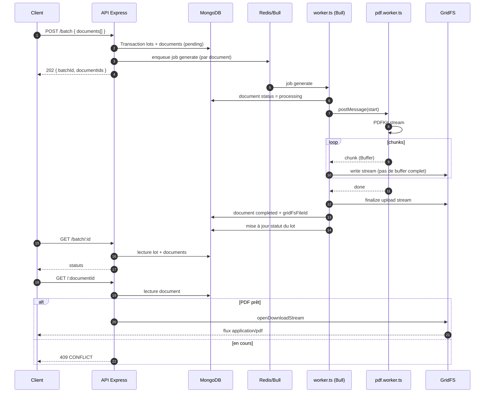

# Document Generator

API Node.js (Express 5) pour générer des PDF par lots : files d’attente **Bull** (Redis), stockage binaire **GridFS** (MongoDB), génération CPU dans des **worker threads** (`pdf.worker.ts` via `parentPort`), disjoncteur **Opossum** sur la lecture des métadonnées GridFS, logs **Winston** avec `x-correlation-id`, métriques **Prometheus**.

## Démarrage rapide

```bash
cp .env.example .env
docker compose up --build
```

API : [http://localhost:3000](http://localhost:3000) — Swagger : [http://localhost:3000/api-docs](http://localhost:3000/api-docs)

En local (MongoDB + Redis requis sur les URLs du `.env`) :

```bash
npm install
npm run build
npm run dev
```

Dans un second terminal, lancez le processeur de file :

```bash
npm run dev:worker
```

## 3. Diagramme de séquence — traitement par lot (Mermaid)



## 4. Justification des choix techniques

- **Bull** : file d’attente mature, backend Redis, nouvelles tentatives / backoff, concurrence configurable, événements sur les jobs.
- **GridFS** : gros fichiers binaires dans MongoDB sans service de stockage supplémentaire ; lecture/écriture en flux.
- **Worker threads** : parallélisme réel pour la génération PDF (CPU) ; un plantage du thread n’entraîne pas tout le process principal.
- **Opossum** : disjoncteur éprouvé pour Node.js, fallbacks et événements exploitables pour la résilience (ici autour de la lecture des métadonnées GridFS).

## 5. Quick start (rappel)

```bash
cp .env.example .env
docker compose up
```

## 6. Documentation des endpoints (exemples curl)

**Santé**

```bash
curl -s http://localhost:3000/health
```

**Métriques**

```bash
curl -s http://localhost:3000/metrics
```

**Créer un lot (202)**

```bash
curl -s -X POST http://localhost:3000/batch \
  -H "Content-Type: application/json" \
  -H "x-correlation-id: demo-1" \
  -d '{"documents":[{"title":"Rapport","content":"Contenu du rapport."}]}'
```

**État du lot** (remplacer `BATCH_ID`)

```bash
curl -s http://localhost:3000/batch/BATCH_ID
```

**Télécharger le PDF** (remplacer `DOCUMENT_ID` ; peut répondre `409` tant que le job n’est pas terminé)

```bash
curl -s -D - http://localhost:3000/DOCUMENT_ID -o sortie.pdf
```

## 7. Instructions de benchmark

1. Démarrer l’API et les dépendances (`docker compose up` ou `npm run dev` + worker + Mongo + Redis).
2. Installer un outil HTTP, par exemple [autocannon](https://github.com/mcollina/autocannon) : `npm i -g autocannon`.
3. Exemple charge lecture (métriques, sans rate limit fort sur `/metrics` si vous testez autre chose, ajustez `RATE_LIMIT_*` dans `.env`) :

```bash
npx autocannon -c 50 -d 30 http://localhost:3000/health
```

4. Pour stresser `POST /batch`, préparez un fichier JSON et lancez :

```bash
npx autocannon -m POST -H "content-type=application/json" -b @payload.json -c 10 -d 20 http://localhost:3000/batch
```

5. Surveillez `GET /metrics` (latences histogrammes, compteurs HTTP, jobs PDF) pendant le test.

## 8. Variables d’environnement

| Variable | Description | Exemple |
|----------|-------------|---------|
| `PORT` | Port HTTP de l’API | `3000` |
| `NODE_ENV` | Environnement d’exécution | `development` / `production` / `test` |
| `LOG_LEVEL` | Niveau Winston | `info` |
| `MONGODB_URI` | URI de connexion MongoDB | `mongodb://localhost:27017/document-generator` |
| `REDIS_URL` | URI Redis (Bull) | `redis://localhost:6379` |
| `BULL_QUEUE_NAME` | Nom de la file Bull | `document-pdf` |
| `PDF_WORKER_CONCURRENCY` | Concurrence des jobs PDF côté worker | `2` |
| `GRIDFS_BUCKET_NAME` | Nom du bucket GridFS | `pdfs` |
| `CIRCUIT_TIMEOUT_MS` | Timeout Opossum (ms) | `10000` |
| `CIRCUIT_ERROR_THRESHOLD_PERCENTAGE` | Seuil d’erreurs pour ouvrir le circuit | `50` |
| `CIRCUIT_RESET_TIMEOUT_MS` | Délai avant demi-ouverture (ms) | `30000` |
| `CIRCUIT_VOLUME_THRESHOLD` | Volume minimal avant évaluation du circuit | `5` |
| `RATE_LIMIT_WINDOW_MS` | Fenêtre du rate limiter (ms) | `60000` |
| `RATE_LIMIT_MAX` | Nombre max de requêtes par fenêtre (hors `/health`, `/metrics`, `/api-docs`, `/openapi.yaml`) | `120` |

## Tests et qualité

```bash
npm test
npm run lint
npm run build
```

## Fichiers utiles

- Spécification OpenAPI : `docs/openapi.yaml`
- Collection Postman v2.1 : `postman/document-generator.collection.json`
